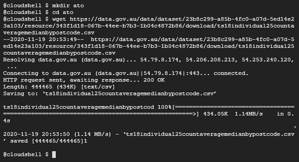
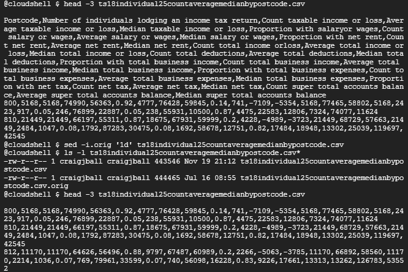
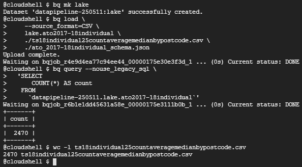
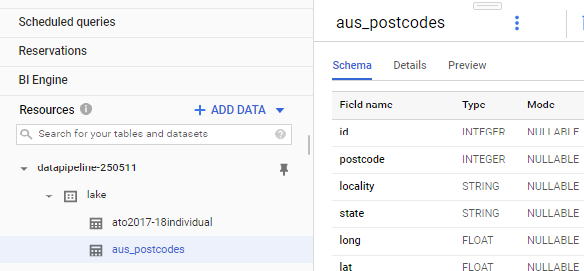
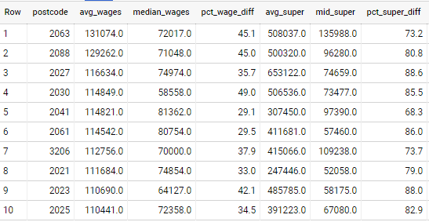
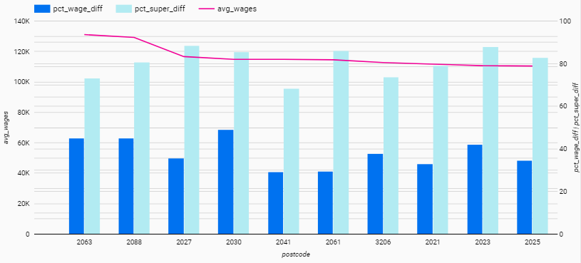

# BigQuery: Load Data with Cloud Shell

### *Demonstrating the simplest method of loading data into Google BigQuery.*
<br>

Use Google Cloud Platform's Cloud Shell to download data and use the bq command line utility to load the data into BigQuery. This eliminates the need to onfigure any additional computing resources.

For this example, taxation statistics for FY 2017-18 from the ATO (Australian Tax Office) is used. More information about this dataset can be found [here](https://data.gov.au/data/dataset/taxation-statistics-2017-18/resource/343f1d18-067b-44ee-b7b3-1b04c4872b86).  
<br>
## Downloading data via Cloud Shell

Login to [GCP Console](https://console.cloud.google.com/) and activate cloud shell. Make a new directory called ato. Use wget to download the [tax statistic file]( https://data.gov.au/data/dataset/23b8c299-a85b-4fc0-a07d-5ed14e23a103/resource/343f1d18-067b-44ee-b7b3-1b04c4872b86/download/ts18individual25countaveragemedianbypostcode.csv) .


<br>
## Remove header row 

Remove header row prior to loading. This is optional as the bq flag --skip_leading_rows can be used to skip lines from the top of the file.  


<br>
## Load data using bq

Use the bq command line tool to specify the source file, source format, destination table details and schema.  The schema file is optional as the --autodetect flag can be used.  However, if the field type is not what is desired, it cannot be changed later.  A JSON schema was defined for this load job.

```
[
  {
    "name": "postcode",
    "type": "integer",
    "mode": "NULLABLE"
  },
  {
    "name": "no_ind_lodging_tax_return",
    "type": "INTEGER",
    "mode": "NULLABLE"
  },
  {
    "name": "count_taxable_income_loss",
    "type": "INTEGER",
    "mode": "NULLABLE"
  },
  {
    "name": "avg_taxable_income_loss",
    "type": "FLOAT",
    "mode": "NULLABLE"
  },
  {
    "name": "median_taxable_income_loss",
    "type": "FLOAT",
    "mode": "NULLABLE"
    ....
```
First create a dataset `lake` to hold the table.  Load the file into the new table `ato2017-18individual`.



Postcode to state and locality mapping will be useful.  This information is available at this [site](https://www.matthewproctor.com/Content/postcodes/australian_postcodes.csv) although the latest postcodes changes may be missing.  This data was loaded using the --skip_leading_rows and --autodetect flags.


Both tables are now available on the GCP Console in the `lake` dataset.


<br>
## Run Queries via BigQuery console

```
SELECT
  postcode,
  avg_wages,
  median_wages,
  ROUND((avg_wages - median_wages)/avg_wages*100,1) AS pct_wage_diff,
  avg_super_balance AS avg_super,
  median_super_balance AS mid_super,
  ROUND((avg_super_balance - median_super_balance)/avg_super_balance*100, 1) AS pct_super_diff
FROM
  `datapipeline-250511.lake.ato2017-18individual`
ORDER BY
  avg_wages DESC
LIMIT
  10
```

Results in table form and graphed using Data Studio.  The results show superannuation balance differences between mean and median are disproportionately higher compared to wage differences between mean and median for the Top 10 postcodes with highest average wage.




